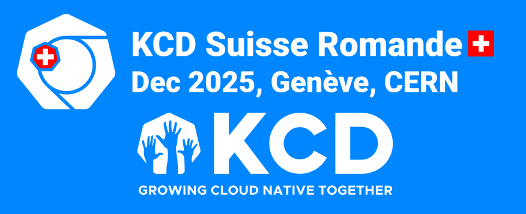

# KCD Suisse Romande Media Kit

This repository contains the main promotion graphics and other materials
for the conference participants, press, sponsors and partners.
Any promotion will be appreaicted!

## References

- Conference site: [https://kcd.cloud-native-romandy.ch/](https://kcd.cloud-native-romandy.ch/)
- Program: [https://sessionize.com/view/rlq5we3p/GridSmart](https://sessionize.com/view/rlq5we3p/GridSmart)

## Social Media

- Hashtag: `#KCDSuisseRomande`
- Summary text:
  - On 04-05 December 2025, join us at CERN for Kubernetes Community Days (KCD)! This will be a full-day day event, focused on cloud native projects and the local community. The talks will be in both French and English. We plan to have about 300 participants. The event is organized by the "Cloud Native Suisse Romande" association.

## Artwork

See this directory for the attachments:

- [logo](./logo/)
- [banners](./banners/) for social media
- [video trailer](./kcd-suisse-romande-trailer.mp4)

